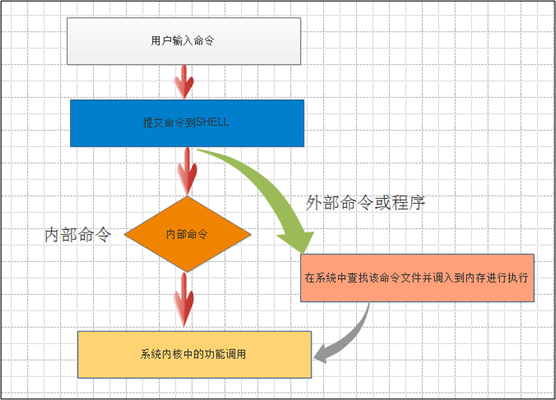

# 1. 终端

## 1.1 终端类型

真正的终端为外设键盘, 鼠标, 显示器等.

1. 仿真终端: 桌面的Terminal等.
2. 远程终端: Xshell, CRT等

查看终端:

```bash
[appgess@localhost Desktop]$ tty
/dev/pts/0
```

## 1.2 终端通信

1. 指定通信

   ```bash
   [root@localhost Desktop]# echo ls > /dev/pts/2
   [root@localhost Desktop]#
   
   #/dev/pts/2终端中显示
   [root@localhost ~]# ls
   
   ```

2. 广播通信

   shutdown命令也是利用这种形式对全部shell进行提示. 包含自己的全部终端都会收到此提示消息.

   ```bash
   [root@localhost Desktop]# wall "aa"
   [root@localhost Desktop]# 
   Broadcast message from root@localhost.localdomain (pts/0) (Sat Jul 11 18:21:20 2020):
   
   aa
   
   ```


# 2. shell

用户与内核交互的一种接口. 接受用户输入并送入内核进行执行. 



* 内部命令:  系统启动时调用存入内存, 常驻内存, 执行效率高
* 外部命令:  系统软件功能, 用户在需要时候才从硬盘中读入内存

命令类型查看方法

```bash
[root@localhost ~]# type pwd
pwd is a shell builtin  # 内部命令
[root@localhost ~]# type -f cat
cat is hashed (/bin/cat)  # 外部命令
```

## 2.1 shell命令

### 2.1.1 命令形式

linux命令格式如下:

```bash
命令   [选项]  [参数]
```

* 命令: `ls/pwd/ifconfig...`
* 选项: 可选常常以`-`或者`--`开头
* 参数:  命令传入的参数

例如:

```bash
cat [-AbeEnstTuv] [--help][--version] fileName
```

* -A|--show-all: 表示展示所有，等同于-vET
* -b|--number-nonblank: 输出带有行号的字符到基本输出设备（一般是屏幕）
* -e: 等同于-vE
* -E|--show-ends: 在每行的最后展示`$`符号；就是无论你输入了什么，屏幕会直接显示你刚才输入的内容，并且在每行最后用`$`符号结尾
* -n|--number: 显示行号
* -s|--squeeze-blank: 剔除空行输出
* -t: 等同于-VT
* -T|--show-tabs: 展示tab信息, 以`^I`的形式

* -u: 忽略
* -v|--show-nonprinting: 使用`^`和`M-`来替换无法显示的字符.


### 2.1.2 命令别名

一些命令为了简化起了别名, 例如

```bash
[root@localhost 2020-03-22]# type ll
ll is aliased to `ls -l --color=auto'  # ls 等同于 ls -l --color-auto
```

也可以自己配置别名命令:

1. 当前tty临时生效

   ```bash
   [root@localhost 2020-03-22]# py3
   -bash: py3: command not found
   [root@localhost 2020-03-22]# alias py3=python3
   [root@localhost 2020-03-22]# py3
   Python 3.7.2 (default, Jun 14 2020, 19:27:22) 
   [GCC 4.4.7 20120313 (Red Hat 4.4.7-23)] on linux
   Type "help", "copyright", "credits" or "license" for more information.
   >>> 
   
   ```

2. 指定用户生效

   将上述命令增加到 `~/.bashrc`文件中, 重启shell或者`source ~/.bashrc`即可

3. 全用户生效

   将1中命令增加到`/etc/bashrc`中, `source /etc/bashrc`即可


# 3. 命令

## 3.1 时间

Linux时间有两种时间:

1. 系统时间: 指使用内核Kernel中的时间. 配置命令`date`
2. 硬件时间: 系统启动时, 内核将读取硬件时间并设置, 然后独立运作`hwclock`.

```bash
[root@localhost 2020-03-22]# hwclock
Sat 11 Jul 2020 07:24:47 PM CST  -0.625788 seconds
[root@localhost 2020-03-22]# date
Sat Jul 11 19:24:50 CST 2020
[root@localhost 2020-03-22]# 
```

* UTC: 世界时间
* GMT: 格林威治时间
* CST: 中国标准时间

### 3.1.1 date

```bash
Usage: date [OPTION]... [+FORMAT]
  or:  date [-u|--utc|--universal] [MMDDhhmm[[CC]YY][.ss]]
```

* -d|--date: 显示指定时间

  ```bash
  [root@localhost 2020-03-22]# date -d "+1 day"
  Sun Jul 12 19:32:17 CST 2020  # 一天后时间
  [root@localhost 2020-03-22]# date
  Sat Jul 11 19:32:19 CST 2020
  ```

* -s|--set: 设置时间

  ```bash
  [root@localhost 2020-03-22]# date -s "2020-07-11 19:36"
  Fri Jul 10 19:36:00 CST 2020
  ```

* -u|--utc: 显示utc时间

* -r|--reference: 显示文件上次修改时间

* -R|--rfc-2822:以RFC 2822格式显示时间

### 3.1.2 time

用于获取命令执行时间

```bash
[root@localhost 2020-03-22]# time ls /
bin  boot  dev  etc  home  lib  lib64  lost+found  media  mnt  opt  proc  root  sbin  selinux  srv  sys  tmp  usr  var

real	0m0.002s
user	0m0.001s
sys	0m0.001s
```

* real: 实际时间
* user: 用户使用的时间
* sys: 内核使用时间